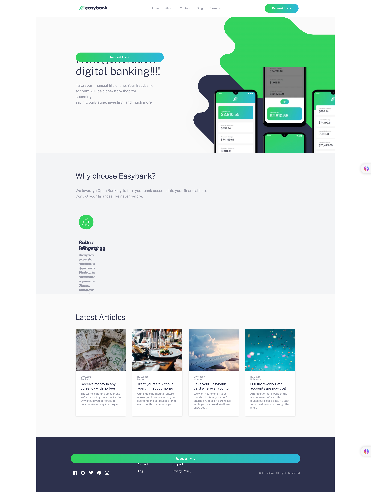
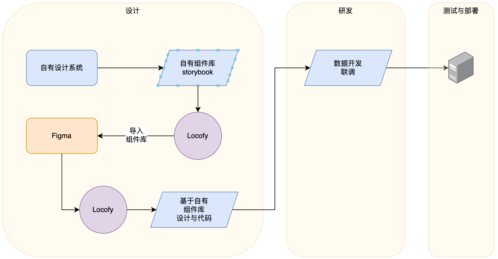

# Locofy 调研

## 调研目的

::: tip
Frontend development accelerated with AI

Turn `designs` into `frontend code` for web & mobile. Build `full apps`, `screens`, `components` & `design systems`!

Ship products 10x faster with your existing design tools, libraries, tech stack & CI/CD workflows

这段文字摘自 [locofy](https://www.locofy.ai/) 官网, 简单来讲 locofy 是一个 设计器插件 它可以将 设计文档直接转换成 前端的代码, 从而提高交付效率
:::

- 初步调研的目标
  - locofy 的 实操流程
  - locofy 涉及到的相关工作角色及其职责的变化
  - locofy 能干什么以及不能干什么
  - locofy 到底能带来多少效率提升

## 调研报告设计

- 首先我选一个 经典的 网页设计稿 [Easybank landing page](https://www.figma.com/community/file/1238393827801856905)


- 接下来我利用 locofy 将这个设计稿转换成代码

- 基于转换后的代码, 我会对比其 与 知名 IT 博主写的 [ fem-easybank 源代码](https://github.com/thecodercoder/fem-easybank), 分析他们的区别在哪里

- 最后针对本次调研目标, 我会给出我的初步结论

## 调研报告

- 首先我强烈建议你先看看下面的 locofy 官方视频, 这个视频会让你对 locofy 有一个大致的了解

<iframe src="//player.bilibili.com/player.html?aid=574999995&bvid=BV1pz4y1u7PZ&cid=1239250115&page=1" scrolling="no" border="0" frameborder="no" framespacing="0" allowfullscreen="true"> </iframe>

### 操作步骤

- 启动插件

  这个步骤是将 locofy 插件安装到你的设计器里面, 这里我选择的是 figma

  - 在设计稿中使用 locofy 插件, 启动插件面板
  - 在 Easybank 案例里面有 3 个 Page, 我选择的是 `Page Set`
  - 在 Easybank 案例里面有 3 个 Frame 我选择的是 `Desktop`

- 第一个步骤 优化设计 `Optimise Design`

  这个步骤是 代码转换前的预处理, 将 Figma 稿件中不必要的元数据去掉 例如 `group`

  - 这里 locofy 提供了 3 个子优化步骤, 这里我尽可能选择默认的选项, 减少人工的干预

    - 优化 设计结构 `Fix Design Structure`
    - 自动布局 `Auto Layout`
    - 适应不同屏幕大小 `handle different screen sizes`

- 第二个步骤 打标签 `Tag interactive elements / Tag your layers`

  这个步骤是为了告诉 locofy 哪些元素是可以交互的, 例如 `button` `input` 等等

  - 手动打标签
  - 自动打标签 `Auto Tag`

    同样的, 这里我选择自动, 但是实际上你依然需要针对每个标签进行手动确认

- 第三个步骤 编辑样式与布局 `Edit Style and Layout`

  暂时省略

  - 这一步暂时省略

- 第四个步骤 增加动作 `Add Actions`

  暂时省略

  - 这一步暂时省略

- 第五个步骤 生成代码 `Sync to Locofy Builder`

  这个步骤是生成代码并同步到 locofy 的代码编辑器里面

  - 这里用的是 `NextJS` 框架
  - 样式架构 是 CSS In Module
  - 识别组件

- 第六个步骤 同步项目 `Sync Project`

  这个步骤是把 locofy 的代码同步到你的项目里面 这里支持 `Github`

  - 同步到 我的仓库 [locofy-demo](https://github.com/fancn21th/locofy-demo)
  - clone 这个仓库到本地

    - 安装依赖包
    - 启动

      - 解决了一个 `CSSProperties` 无法变异的问题

      ```jsx
      propWidth?: CSSProperties["width"]; // 修改前

      propWidth?: React.CSSProperties["width"]; // 修改后
      ```

### 结果初见

令人期待的结果来了



这里我不做点评直接上最后结论

### 初步结论

- locofy 的 实操流程
  - 整个流程本质上就是在给人工智能打标签做转换
  - 打标签的过程目前还需要人工干预和确认
- locofy 涉及到的相关工作角色及其职责的变化
  - 设计师的产出物需要更加规范化, 以便于 locofy 自动识别
  - 前端工程师需要熟悉 locofy 的代码生成规则, 才能充分发挥 locofy 的自动化能力
- locofy 能干什么以及不能干什么
  - 能
    - 自动识别设计稿中的元素, 并生成对应的代码
    - 自动纠正设计稿中的元素, 使其符合 locofy 的代码生成规则
    - 自动识别源代码中的组件, 避免生产代码的重复
  - 不能
    - 它是效率工具, 不是代替人工的工具
- locofy 到底能带来多少效率提升
  - 从默认的实现效果来看 如果不给予足够的人工干预, locofy 生成的代码是无法直接投入生产
    - 目前看, 主要问题是 响应式, 定位的问题 这些问题都需要人工干预, 但是我相信如果工程师熟悉掌握后, 带来的效率提升是非常可观的
  - 从生成的代码来看, locofy 生成的代码是规范和直观的, 方便工程师理解和维护
    - 代码风格肯定和纯人工编写的代码有差异, 简洁直观死板而有失优雅, 但是方便维护
    - AI 提供了组件识别 这样可以避免重复代码
    - 数据处理代码部分还没有看到官方的方案, 目前来看要人工完成

#### 小结

传统开发, 低代码, 人工智能 他们三者都会在未来的 应用研发领域 各自占据一部分市场

- 低代码面向的是 非专业开发人员, 他们可以通过低代码平台快速的搭建出一个应用 但是一旦涉及到定制化的需求, 低代码平台就会显得力不从心
- 人工智能面相的是 专业开发人员, 它是效率工具, 但是效率的高低取决于工程师的熟练程度
- 传统开发我认为在未来的一段时间内, 仍然是主流, 但是随着人工智能的发展, 传统开发的效率会被人工智能逐渐超越, 这是必然的趋势
  - 这就好比 发生在飞机驾驶舱中的变化, 过去我们看到飞机驾驶舱里面有很多的仪表, 需要飞行员去操作, 但是现在的飞机驾驶舱里面的仪表越来越少, 因为飞行员的工作已经被自动驾驶系统取代了

## 下一步

深入研究 locofy 的代码生成规则 和 人工干预功能的设计目的详细使用方法

## 补充

在本周的调研最后, 我浏览了文档所有章节, 其中 `UI Libraries & Design System` 吸引了我的注意, 尤其是 `Bring your own storybook components` 这一节

简单来说 在 figma 中, 你可以导入你的组件库, 设计师可以直接把组件库里面的组件拖拽到设计稿中, locofy 会自动识别组件库中的组件, 并生成对应的代码

这可以说是杀手锏, 现在我最想探索的就剩下 如何处理数据状态了


