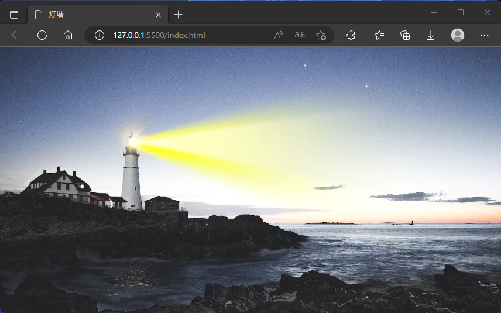
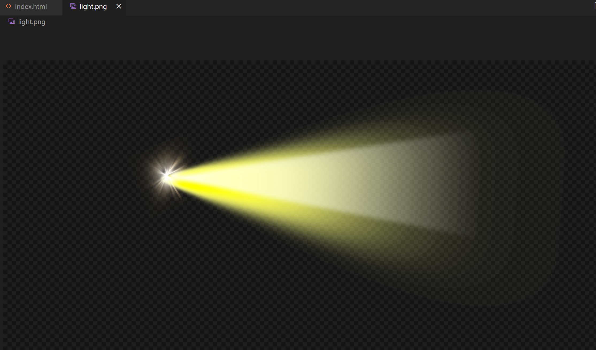
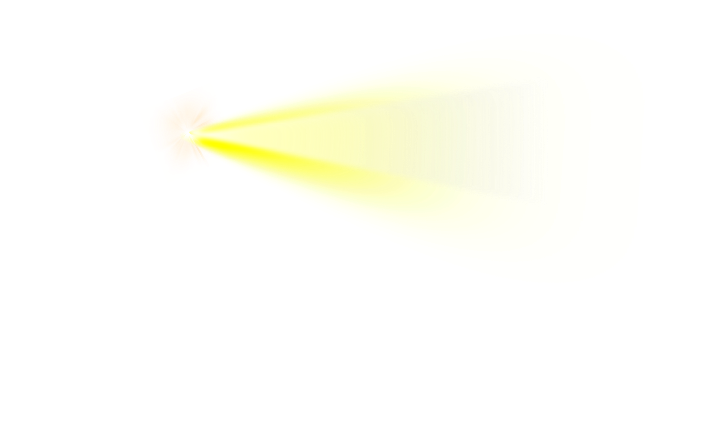
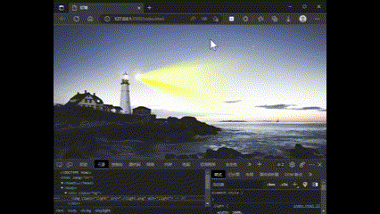
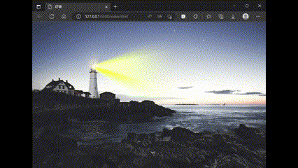
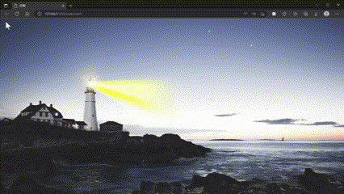

# 静态 UI 切图实现旋转动效

## 介绍

本文将通过 html+css 代码，使用一张静态的光柱效果图片，配合 css 动画、旋转等属性来实现灯塔灯光旋转的效果。通过本文，你可以了解到 css 的**transform-origin**、**animation**、**perspective**等属性如何使用。

## 开发

### 静态效果

首先看下不加动画下的效果，这里是一张背景图，加上一个光效的图，两张图原始宽度是一样的，所以只要设置同样宽度，光效和灯塔能契合在一起。


这是光效原图的样子


html 代码

```html
<body>
  <div class="bg">
    
  </div>
</body>
```

css 样式

```css
body {
  margin: 0;
  background-color: rgba(47, 84, 235, 0.4);
}
.bg {
  width: 100vw;
  height: 100vh;
  background-image: url('./bg.png');
  background-size: 100%;
  background-repeat: no-repeat;
  overflow: hidden;
}
.light {
  width: 100%;
}
```

### 2d 旋转效果

css 样式

```css
.light {
  width: 100%;
  animation: light 5s 0s cubic-bezier(0.8, 0.2, 0.2, 0.8) infinite running;
}
@keyframes light {
  from,
  to {
    transform: rotateY(-60deg);
  }
  50% {
    transform: rotateY(60deg);
  }
}
```

效果图


css 动画**animation**属性，需要我们先定义一个 **@keyframes**（关键帧），把这个命名传给**animation**，这个具体不在这赘述，大家可以在 mdn 上查看使用方法，[animation](https://developer.mozilla.org/zh-CN/docs/Web/CSS/animation)，[@keyframes](https://developer.mozilla.org/zh-CN/docs/Web/CSS/@keyframes)。
我们在 **@keyframes**上定义了旋转方向和角度，这里用的是**rotateY**，就是随 Y 轴转动，也就是纵向，而且默认是中心位置，所以效果是上图那样，我们可以看到图像宽度随着旋转也在发生变化，变窄了，因为这是个 2d 平面，就好比在你眼前沿着纵向旋转一张纸。我们可以通过下图，可以看到 X 轴是横向，Y 轴是纵向，Z 轴就是屏幕对着我们眼睛的方向。具体可以访问[CSS transform 属性](https://zhuanlan.zhihu.com/p/398646182)。
（图源知乎）

我们想要灯光旋转中心是灯塔发射光线的地方，所以需要用到**transform-origin**属性，就是旋转的原点，由于两张图片大小一样，所以我们可以设个百分比，测量后大概是 26.3%，这时候我们再看看效果。

css 样式

```css
.light {
  width: 100%;
  transform-origin: 26.3%;
  animation: light 5s 0s cubic-bezier(0.8, 0.2, 0.2, 0.8) infinite running;
}
```

效果图


### 3d 旋转效果

这时候和我们想要的效果差不多了，但还差了点什么，没有 3d 的感觉，这时候需要用到一个 css 属性**perspective**，参照[perspective](https://developer.mozilla.org/zh-CN/docs/Web/CSS/perspective)，这个属性讲通俗点就是设置人眼与元素之间的距离，单位是 px，但是这个属性要设置在父元素（其他上级元素也可以）上，我们加上试一试

css 样式

```css
.bg {
  width: 100vw;
  height: 100vh;
  background-image: url('./bg.png');
  background-size: 100%;
  background-repeat: no-repeat;
  overflow: hidden;
  perspective: 500px;
}
```

效果图


这样看起来是不是有一种“近大远小”的感觉了，虽然不是真正的 3D 效果，但我们也可以用这种平面图形来实现伪 3D 效果。还有一些其他 transform 效果，大家也可以多试试，可以达到更多酷炫的动画效果。
