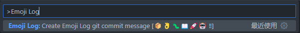
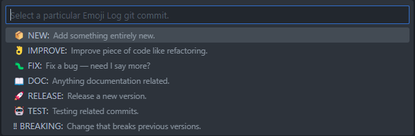
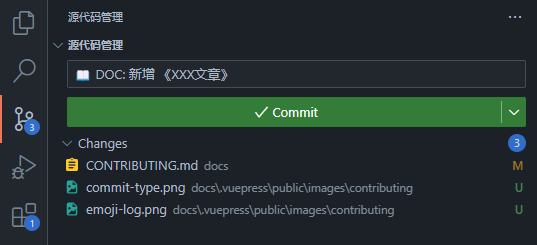

# 贡献指南

## 贡献前的准备

### 准备开发环境

- 安装 [Node.js](https://nodejs.org/zh-cn/) v14.18.0+
- 安装 [Yarn v1](https://classic.yarnpkg.com/en/docs/install#windows-stable)
- 安装 [Git](https://git-scm.com/downloads) 并熟悉基础用法
- 安装 [Visual Studio Code](https://code.visualstudio.com/)
- 安装 [EMOJI-LOG](https://github.com/ahmadawais/Emoji-Log) 的 VSCode 插件：[Emoji-Log for VSCode](https://marketplace.visualstudio.com/items?itemName=ahmadawais.emoji-log-vscode)

### 提交 PR 前你应该知道

- 我们通常推荐以较小的粒度提交 PR，比如：
  - 上传一篇文章
  - 修改一个 bug
  - 新增一个功能
  - 增强一个功能
- 一个好的 PR 应该能够通过标题和描述清楚地表达出涉及到的改动范围和意图，这可以帮助管理者对 PR 进行合并

## 贡献工作流

### 1. Fork 仓库

- [访问该仓库](https://github.com/digitalchina-frontend/digitalchina-frontend.github.io) 并用你的 GitHub 账号 `fork` 它

### 2. Clone 你的仓库

- 选择 `SSH` 方式或 `HTTPS` 方式 Clone 仓库
- 基于 `main` 分支创建自己的 pr 分支，比如 `pr/xxx-docs`

<CodeGroup>
  <CodeGroupItem title="SSH">

```bash
git clone git@github.com:YOUR_USERNAME/digitalchina-frontend.github.io.git && cd digitalchina-frontend.github.io
git checkout -b pr/<branch-name>
```

  </CodeGroupItem>
  <CodeGroupItem title="HTTPS">

```bash
git clone https://github.com/YOUR_USERNAME/digitalchina-frontend.github.io.git && cd digitalchina-frontend.github.io
git checkout -b pr/<branch-name>
```

  </CodeGroupItem>
</CodeGroup>

### 3. 安装依赖

由于 `VuePress V2` 处于 beta 阶段，不推荐使用 `npm` 包管理器安装依赖，推荐使用 `yarn` 来安装

```bash
yarn
```

### 4. 本地运行应用

<CodeGroup>
  <CodeGroupItem title="YARN">

```bash
yarn docs:dev
```

  </CodeGroupItem>
  <CodeGroupItem title="NPM">

```bash
npm run docs:dev
```

  </CodeGroupItem>
</CodeGroup>

该项目现已启动并运行在 [http://localhost:8080](http://localhost:8080) 上，你现在可以为网站内容做出贡献了！🚀

### 5. 贡献代码并构建

#### 编写技术文档

在贡献前，你需要了解 [前端网站目录结构规范](/develop/vuejs/directory-structure-specification)，以便于在正确的目录下创建文档文件并配置导航栏。

#### 构建项目以避免提交有问题的代码

完成编写后，请运行 `build` 命令检查运行结果，确保无报错信息后再提交。

<CodeGroup>
  <CodeGroupItem title="YARN">

```bash
yarn docs:build
```

  </CodeGroupItem>
  <CodeGroupItem title="NPM">

```bash
npm run docs:build
```

  </CodeGroupItem>
</CodeGroup>

### 6. 提交

如果你是第一次使用 `git`，需要配置用户信息：

```sh
git config --global user.email "you@example.com"
git config --global user.name "Your Name"
```

如果你是首次使用 HTTPS 方式推送代码，需要配置鉴权方式：

```sh
git config --global credential.githubauthmodes browser
```

#### 方式一：通过 VSCode 源代码管理提交（推荐）

1. 使用 `Ctrl + Shift + P` 打开 VSCode 命令，搜索并执行 `Emoji Log`



2. 选择一个 `commit type`，比如上传一篇文章，则选择 `📖 DOC: ` 类型



3. 进入 主侧边栏-源代码管理 补齐 `commit message` 的主题内容



4. 依次点击 `Commit`、`Push` 按钮


:::tip
如果点击 Commit 按钮出现报错：`npx: command not found`，请尝试重启 VSCode，如仍然报错，建议通过命令行提交
:::

#### 方式二：通过命令行提交

1. 参考 [Emoji-Log Guide](https://github.com/ahmadawais/Emoji-Log#bashzsh-workflow) 对 git bash 安装目录中 的`~/.bashrc` 文件进行配置，若报错可尝试创建空白的 `~/.bash_profile` 文件，之后重新启动 `Git Bash`
2. 在 `Git Bash` 中执行以下命令：

根据 `commit type` 选择其中一个命令进行提交

```sh
gnew '添加XXX功能'
gimp '增强XXX功能'
gfix '修复XXX问题'
gdoc '提交《XXX文章》'
grlz '发布XXX版本'
gtst '测试XXX提交'
gbrk '进行了一次不兼容旧版本的修改'
```

### 7. 发起 PR

要发起一个 PR，你可以参考 [GitHub Pull Request UI](https://docs.github.com/cn/pull-requests/collaborating-with-pull-requests/proposing-changes-to-your-work-with-pull-requests/creating-a-pull-request) 通过浏览器仓库界面或 GitHub CLI 等方式提交 PR。
