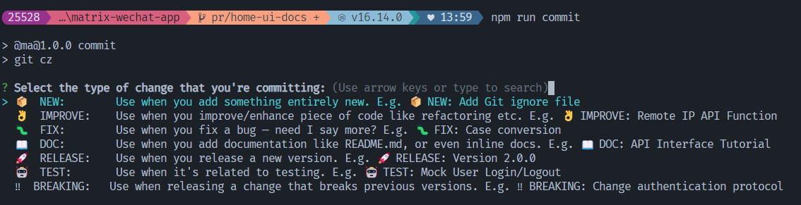
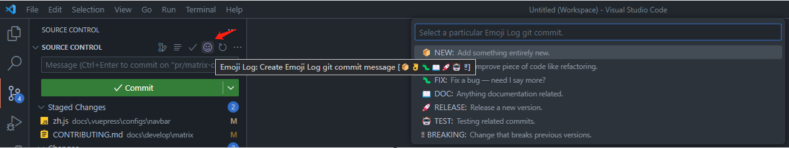

# Contribute to Matrix

感谢您有兴趣为 Matrix 做贡献，我们很高兴您想加入这个社区。

Matrix 是由武汉云基地前端团队管理的开源项目，Matrix 致力于收集 2B 交付在小程序、中后台、数据可视化三个方向上的经典业务场景，分析每一个业务场景从需求分析到代码实现的过程中所涉及的必要知识，以最佳实践、解决方案文档、在线示例、可复用代码等形式，帮助前端开发者在尽可能短的时间内付出较少的学习成本产出高质量、可交付的代码，从而提升前端开发团队的效率。

欢迎所有形式的贡献，包括：贡献代码、贡献文档、贡献问题、提供业务场景、更新已有内容、帮助人们等等；通过为开源项目做贡献，您可以学习新技能、成为细分领域专家并将所有知识应用到您自己的项目中。

## 如何贡献业务场景

贡献业务场景是帮助 Matrix 完善功能矩阵的首选方式，一个有价值的业务场景往往符合以下特点：

- 实现前需要查阅资料或参考他人代码
- 编码过程中频繁踩坑
- 测试人员集中报告 bug 的业务功能

如果您有这样的经历，您可以通过适当的方式贡献业务场景：

- 方式一：通过[在线表格](https://doc.weixin.qq.com/sheet/e3_AAIAhAYhAL8EwM3EqSvRFavznf5fA?scode=AGEA5AcDAAok6EZiqqAAIAhAYhAL8&tab=BB08J2&journal_source=chat&roomid=Room%3A53330857886161&open_source=wecomgroup&version=4.1.0.6011&platform=win)填写业务场景的相关信息（首选）：

  我们的团队成员会根据您填写的内容进行讨论，必要时会联系您以获取更详细的信息

- 方式二：在 Github 仓库创建 Issue，对于一个业务场景，请在您的 Issue 中包含：
  - 行业背景
  - 业务场景描述
  - 您当前采用的解决方案（可选）
    每个 issue 在开始 PR 之前会进行充分的讨论和设计，我们会尽最大努力尽快做出回应。

## 如何提交 Pull Request (PR)

为开源做出贡献的很大一部分是提交对该项目的更改，比如对源代码的改进、对文档内容的更新，甚至是对拼写错误和过期链接的修复。

### 什么是 PR ？

如果您不了解，这里是 GitHub 上人们对它的[定义](https://docs.github.com/en/pull-requests/collaborating-with-pull-requests/proposing-changes-to-your-work-with-pull-requests/about-pull-requests)：

> 拉取请求让您可以告诉其他人您已推送到 GitHub 存储库分支中的更改。打开拉取请求后，您可以与协作者讨论和审查潜在的影响，并在您的更改合并到主分支之前添加后续提交。

任何人都可以发起 PR，所有的贡献者都遵循相同的过程，无论是来自团队内部还是开源贡献者。

如果您要解决的问题还没有相关的 issue，我们通常建议在提出 PR 之前打开一个 issue，这有助于在实施之前进行讨论，如果您的 PR 改动较小，比如修复错别字或修复链接，直接提出 PR 可能比较合适。

### 贡献前的准备

- 您安装了 >= v15 和 <= v18 的 [Node.js](https://nodejs.org/zh-cn/)
- 您安装了 [Git](https://git-scm.com/downloads) 并熟悉基础用法

#### 关于 CommitLint

为了规范提交格式，我们使用了 [EMOJI-LOG](https://github.com/ahmadawais/Emoji-Log#philosophy) 作为 Git 提交消息的标准并启用了 `commitlint` 帮助团队遵守提交约定，请仅使用以下 Git 提交消息：

1. `📦 NEW: IMPERATIVE_MESSAGE_GOES_HERE`
   > 当您添加全新的内容时使用。例如 📦 NEW: Add Git ignore file
2. `👌 IMPROVE: IMPERATIVE_MESSAGE_GOES_HERE`
   > 当您改进/增强代码片段（如重构等）时使用。例如 👌 IMPROVE: Remote IP API Function
3. `🐛 FIX: IMPERATIVE_MESSAGE_GOES_HERE`
   > 修复错误时使用 例如 🐛 FIX: Case conversion
4. `📖 DOC: IMPERATIVE_MESSAGE_GOES_HERE`
   > 当您添加文档（如 README.md，甚至内联文档）时使用。例如 📖 DOC: API Interface Tutorial
5. `🚀 RELEASE: IMPERATIVE_MESSAGE_GOES_HERE`
   > 发布新版本时使用。例如 🚀 RELEASE: Version 2.0.0
6. `🤖 TEST: IMPERATIVE_MESSAGE_GOES_HERE`
   > 与测试相关时使用。例如 🤖 TEST: Mock User Login/Logout
7. `‼️ BREAKING: IMPERATIVE_MESSAGE_GOES_HERE`
   > 在发布不向下兼容的更改时使用。例如‼️ BREAKING: Change authentication protocol

您不必在每次提交时手动输入表情符号，我们提供两种方式帮助您构建提交消息：

##### 命令行

运行以下命令，使用 `git-cz` 工具帮助构建提交消息、添加详细描述以及关联 issue：

```sh
npm run commit
```



##### 安装 VSCode 插件

插件链接：[Emoji-Log for VSCode](https://marketplace.visualstudio.com/items?itemName=ahmadawais.emoji-log-vscode)

重新启动 VSCode 后，进入源代码管理模块，点击 Emoji Log 图标，选择一个提交类型即可：



#### 准备本地开发环境

Matrix 使用“monorepo”模式来管理它的文档网站、各个技术栈的源代码以及它的许多依赖，并依赖 [npm workspaces](https://docs.npmjs.com/cli/v7/using-npm/workspaces) 统一本地文件系统中的多个子包。

##### Fork, clone, and branch the repository

- Fork [digitalchina-frontend](https://github.com/digitalchina-frontend) 组织下对应方向的官方仓库
- 拉取代码：`git clone https://github.com/<your-username>/matrix-miniapp.git`
- 安装依赖包：`npm install`
- 创建主题分支：`git checkout -b topics/new-feature-name`
- 在开发模式下运行项目：
  - 微信小程序：下载并打开[微信开发者工具](https://developers.weixin.qq.com/miniprogram/dev/devtools/download.html) -> 导入项目 -> 选择项目根目录下 `apps/wechat` 作为要上传的文件夹 -> 点击直接打开
  - 中后台：
    - 启动所有包：`npm run dev`
    - 限制在单个包：`npm run dev -w @ma/package-name`

### 验证并提交

在您完成修改后，请运行以下命令检查所修改的内容是否有存在潜在风险：

```sh
npm run release:check
```

如果脚本没有抛出错误，请提交您的改动（通过命令行或者 VSCode 源代码管理工具）：

```sh
git add .
npm run commit
```

### 发起 PR

在为 Matrix 发起 PR 时，您需要遵循一些约定：

- 保持你的仓库是最新版本：
  在发起 PR 前检查本地仓库是否落后于上游仓库以避免合并冲突，如何同步上游仓库请参阅：[Git Forks and Upstreams: How-to and a cool tip](https://www.atlassian.com/git/tutorials/git-forks-and-upstreams)
- 参考 [EMOJI-LOG](https://github.com/ahmadawais/Emoji-Log#philosophy) 的标准提供一个符合格式的 PR 标题
- 填写 PR 模板（描述、改动的类型、检查清单）

### 跟进 PR

将 PR 发送到 GitHub 存储库后，Matrix 团队可能会对您的 PR 进行审阅并提出修改建议。

如果您收到了我们的修改请求，您可以在 PR 合并前继续向 PR 添加相关提交，这些提交也将成为此 PR 的一部分。

在解决了所有问题并提交了请求的更改后，您可以将对话标记为已解决。

此过程有助于 Matrix 团队在将更改合并到 Matrix GitHub 存储库之前做出改进。
