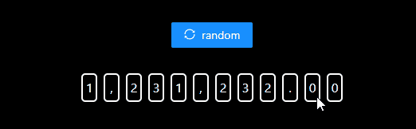
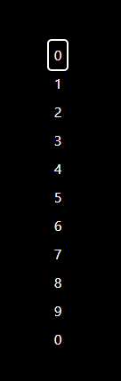
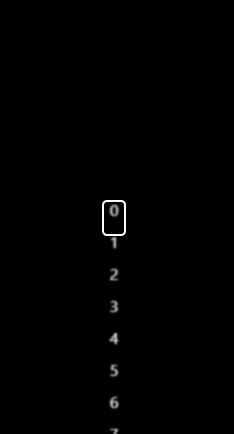
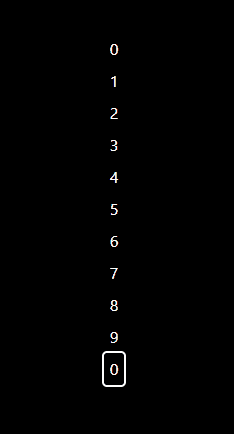
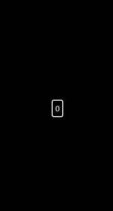
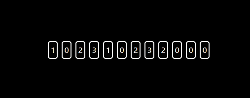
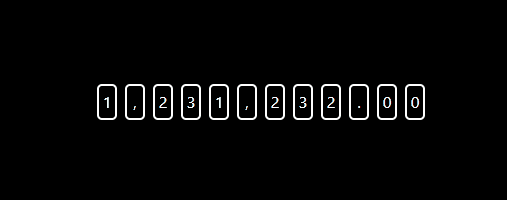
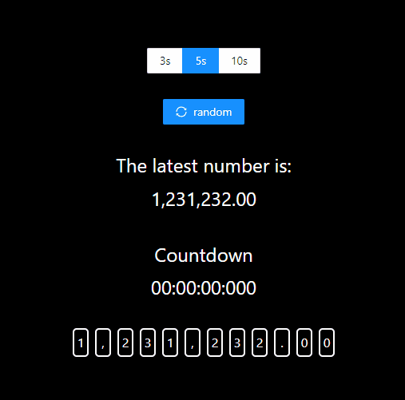

# 使用 GSAP 实现数字滚动特效

## 介绍

在阅读完本文后，您将：
+ 对实现数字滚动特效的实现思路有基本的了解。
+ 对 `GSAP` 的用途和常用 `API` 有基本的了解。
+ 对如何设计并实现一个 `React` 组件的流程有基本的了解。

## 背景知识

本文旨在让初级前端开发人员能够使用 [GSAP（The GreenSock Animation Platform）](https://greensock.com/) 替代 [CSS Animation](https://developer.mozilla.org/zh-CN/docs/Web/CSS/CSS_Animations/Using_CSS_animations) 实现一些简单的特效以获得更优的开发体验和性能表现，并尽可能减少学习成本。

本文以开发一个数字滚动组件的形式对特效开发的步骤进行演示，组件基于 `React` 和 `GSAP` 实现，并附上了关键部分的代码。

如果您是初次听说 `React` 或 `GSAP` 的新手，先学习一些基础知识会有所帮助。

+ `React`: 一个用于构建用户界面的代码库。`React` 组件就像是一个自定义、可重用的 `HTML` 元素一样，能够帮助开发者快速有效地构建用户界面。
  + 通过 [React course on freeCodeCamp](https://www.freecodecamp.org/learn/front-end-development-libraries/#react) 了解有关 `React` 的更多信息。

+ `GSAP`：一个业界知名的动画平台，你可以使用 `GSAP` 为 `JavaScript` 可以触及的几乎所有内容制作动画，无论您是想要为 `UI`、`SVG`、`Three.js` 还是 `React` 组件制作动画，`GSA​​P` 都能满足您的需求。
    + 通过 [Getting Started with GSAP](https://greensock.com/get-started/) 了解有关 `GSAP` 的更多信息。

## 目标效果



[](https://codesandbox.io/s/demo-number-scroll-73w3s2?fontsize=14&hidenavigation=1&theme=dark)

## 开始开发

### 1. 分析需求

+ 该组件接收一个数字用于展示，在这个数字的值改变后，需要展示一个过场动画，并在指定的时间后滚动至新的数字。
+ 在动画过程中，如果传入数字再次改变，重新播放滚动效果并滚动至新的数字。
+ 如果数字中包含负号、小数点或千分位，符号不进行滚动。

### 2. 实现单个数字的滚动效果

#### 2.1 动画分析： 
+ 首先，HTML 元素应该由两部分组成：一个宽高固定并隐藏溢出部分的舞台、一个从 0 到 9 的数字列表，不停移动数字列表即可实现基础的数字滚动效果；
+ 在大部分场景下，需要让用户产生数字滚动速度快到模糊的感觉，可以给滚动中的数字加上一层模糊滤镜，在滚动时间结束后再撤除；
+ 在滚动时间结束后，需要将特定的数字显示到舞台正中的位置，为了制造一种自然滚动直至停下的感觉，这里有两种做法：
  - 视图驱动：将动画时间分为两个部分，第一个部分将数字列表滚动 `n` 圈,第二部分从当前位置缓慢滚动至目标数字，在这整个过程中，数字的滚动速度应该是从一个精准计算的初始速度不断递减直至为零的。
  - 数据驱动：预留一个较短的时间播放收尾的动画，用较长的时间以恒定的、较快的速度无限滚动列表，时间到后，不论列表目前滚动到哪个位置，立即将列表移动到目标数字附近并播放一个收尾动画。

#### 2.2 准备静态的 HTML 元素

+ 准备舞台和数字列表：  

```jsx
const NumberScrollItem = () => {
  const numbers = new Array(10)
    .fill(null)
    .map((_, index) => index)
    .concat(0)
  return (
    <div className='number-scroll__stage'>
      <div className='number-scroll__gimmick '>
        {numbers.map((number) => (
          <div key={uuidV4()}>{number}</div>
        ))}
      </div>
    </div>
  )
}
```


:::tip
这里我们在 0~9 的末尾额外添加了一个 0 ，这样做的目的是让列表从尾部（显示数字 9）切换到头部（显示数字 0）的过程不那么生硬。
:::


#### 2.3 让数字列表滚动起来


这里用到的 `GSAP API` 是 [gsap.fromTo()](https://greensock.com/docs/v3/GSAP/gsap.fromTo())，只需指定 `fromVars`（动画的起始属性）、`toVars`（动画的目标属性）和 `duration` 即可让 `gsap` 补齐中间的动画过程，完成一个基础的滚动效果。

```jsx
const COUNT_OF_NUMBERS = 10 // 隐藏在舞台外的数字个数
const HEIGHT_PER_NUMBER = 32 // 每个数字所占高度
const ONE_LAP = HEIGHT_PER_NUMBER * COUNT_OF_NUMBERS // 列表滚动一圈的位移

const useNumberScroll = (dependencies = []) => {
  const ref = useRef()

  const animate = () => {
    const gimmicSelector = '.number-scroll__gimmick'
    gsap.fromTo(
      gimmicSelector,
      { y: 0 },
      {
        y: -ONE_LAP,
        duration: 3,
        ease: 'none',
      }
    )
  }

  useGSAP({
    animate,
    ref,
    dependencies,
  })
  
  return ref
}

const NumberScrollItem = () => {
  const ref = useNumberScroll();
  return (
    <div className="number-scroll__stage" ref={ref}>
      {/* ... */}
    </div>
  );
};
```

:::tip
`useGSAP` 是基于 `useLayoutEffect` 封装的 `hook`：
```jsx
const useGSAP = ({ animate, ref, dependencies = [] }) => {
  return useLayoutEffect(() => {
    let ctx = gsap.context(animate, ref)
    return () => {
      ctx.revert()
    }
  }, dependencies)
}
```
`gsap.context` 指定了动画的上下文，在 `animate` 函数中书写的选择器都将作用于指定的元素范围内，并且其中出现的所有 `gsap animation` 都可以通过 `ctx.revert()` 或 `ctx.kill()` 统一重置或销毁，而无需手动跟踪一堆变量、数组。
:::


#### 2.4 让数字列表可以无限滚动

`repeat` 属性可以控制动画重复的次数，`-1` 代表无限次。

```jsx
const animate = () => {
  gsap.fromTo(
    gimmicSelector,
    { y: 0 },
    {
      y: -ONE_LAP,
      duration: 3,
      ease: 'none',
      repeat: -1, // 无限重复
    }
  )
}
```
:::tip
duration 表示每一次的动画时间，而不是总的动画时间
:::


#### 2.5 给滚动中的数字加上一层模糊滤镜

为了让数字在滚动的过程中给用户一种滚动得非常快的感觉，我们需要设置一个较大的滚动速度，并且给滚动中的数字加上一层高斯模糊。

+ 如何控制运动速度  
  `gsap` 的运动速度取决于我们传入的位移 `y` 和时间 `duration`，相当于：`speed = y / duration`，在 `y` 确定的情况下，计算一个 `duration` 传给 `gsap` 即可。

+ 高斯模糊（利用 [CSS filter](https://developer.mozilla.org/zh-CN/docs/Web/CSS/filter#filter_%E5%87%BD%E6%95%B0) 属性实现）  
  通常，我们可以简单地使用 `blur()` 函数产生高斯模糊，比如：`filter: blur(1px)`，这里的 `1px` 指定了 [SVG 滤镜 feGaussianBlur](https://developer.mozilla.org/zh-CN/docs/Web/SVG/Element/feGaussianBlur) 的标准差。
  
```jsx
const getScrollSpeed = () => 320 // 设置一个较快的速度即可，单位：px / s  
const getDuration = (s, v) => s / v // 时间 = 位移 / 速度

const animate = () => {
  gsap.fromTo(
    gimmicSelector,
    { y: 0 },
    {
      y: -ONE_LAP,
      duration: getDuration(ONE_LAP, getScrollSpeed()),
      ease: 'none',
      repeat: -1, // 无限重复
      onStart() {
        // 添加模糊滤镜
        gsap.set(gimmicSelector, {
          css: {
            filter: 'blur(1px)',
          },
        })
      },
    }
  )
}
```



#### 2.6 让数字列表停止滚动

在做 [动画分析](#_2-1-动画分析) 时，我们提到了缓慢停下和急停两种停止滚动的做法，这里我们都尝试一下。

##### 视图驱动

缓慢停下是个很符合现实逻辑的做法，整个运动过程相当于一个匀减速直线运动。

要让数字在指定的时间正好滚动至指定位置并停下，我们就需要设定一个初始速度和负的加速度，使运动结束时速度正好等于零；并且总位移在减去从初始值滚至目标值的部分后，必须是滚动一圈的整数倍，否则停止的位置就会偏离我们的目标值。

下面我们用公式梳理下上述条件：

假设初始速度为 `Vο`，加速度为 `a`，总位移为 `s`，运动时间为 `t`，至少需要位移的距离为 `S1`，数字滚动一圈的距离为 `S2`，则：
1. 指定时间后停下：`Vο + at = 0`；
2. 停下时总位移减去必要的位移正好是滚动一圈的整数倍：`(s - S1) % S2 = 0`；
3. 带入位移公式 `s = Vοt + at² / 2` 可以得到：`(Vοt / 2 - S1) % S2 = 0`。

其中，`S2` 是常量，`t` 和 `S1` 是已知的，求 `Vο` 的解，显然 `Vο` 不止一个解，选择一个较大的速度作为初始运动速度即可。

在确定 `Vο` 后，带入 `a = -(Vο / t)` 即可算出对应的加速度。

这一做法确实是可行的，但是显而易见，这种做法会极大增加我们代码的实现难度，而且很难满足一些常见的需求，比如多位数的滚动速度保持一致（因为每个数字的 `S1` 都不相同）。

##### 数据驱动

与缓慢停下的做法相比，急停的做法无疑简单许多：
1. 设定一个播放收尾动画的时间，比如总时长的 `75%` 播放无限滚动，`25%` 播放收尾动画；
2. 通过 `onUpdate`（每次动画更新时触发）和 [this.pause()](https://greensock.com/docs/v3/GSAP/Tween/pause()) 控制无限滚动的时间；
3. 为 `NumberScrollItem` 绑定一个 `data-value` 属性，表示最后滚动到哪个数字；
4. 停止无限滚动后：
   1. 撤除滤镜；
   2. 通过 [HTMLElement.dataset](https://developer.mozilla.org/zh-CN/docs/Web/API/HTMLElement/dataset) 获取目标数字的值；
   3. 用剩下的时间播放一个从目标数字上方滚动至目标数字的动画，使用 [gsap Eases](https://greensock.com/docs/v3/Eases) 中内置的时间函数 `elastic.out()`（ 类似于 [CSS animation-timing-function](https://developer.mozilla.org/zh-CN/docs/Web/CSS/animation-timing-function)）使动画效果更有弹性。

:::tip
第 2 步提到的 `this` 对应一个 [Tween](https://greensock.com/docs/v3/GSAP/Tween/)，可以简单地把它理解为一个高性能的属性设置器。
:::

```jsx
const NumberScrollItem = (props) => {
  const ref = useNumberScroll({
    duration: 5,
  })
  return (
    <div className='number-scroll__stage' ref={ref}>
      <div className='number-scroll__gimmick' data-value={0}>
        {/* ... */}
      </div>
    </div>
  )
}

const ENDING_ANIMATION_PERCENT = 0.25 // 收尾动画的时间占比

const useNumberScroll = ({ duration }, dependencies = []) => {
  const startTime = useRef() // 用于控制无限滚动的时间
  const endingDuration = min([duration * ENDING_ANIMATION_PERCENT, 2]) // 收尾动画最多播放 2 秒
  const loopDuration = duration - endingDuration

  const endAnimate = (ctx) => {
    // 停止无限滚动
    ctx.pause()
    const ele = ctx.targets()[0]
    // 获取目标数字的值
    const value = +ele.dataset.value
    const valueOffset = value === 0 ? 10 : value
    // 撤除滤镜
    gsap.set(ele, {
      css: {
        filter: '',
      },
    })
    // 播放一个从目标数字上方滚动至目标数字的动画
    gsap.fromTo(
      ele,
      {
        y: -((valueOffset - 1) * HEIGHT_PER_NUMBER), // 目标数字的上一个数字
      },
      {
        y: -(valueOffset * HEIGHT_PER_NUMBER),
        duration: endingDuration,
        ease: 'elastic.out(1, 0.3)',
      }
    )
  }

  const animate = () => {
    gsap.fromTo(
      gimmicSelector,
      { y: 0 },
      {
        onStart() {
          startTime.current = Date.now()
        },
        onUpdate() {
          const isEnd = Date.now() - startTime.current >= loopDuration * 1000
          if (isEnd) endAnimate(this)
        },
      }
    )
  }
}
```




### 3. 组件接口设计

根据需求可以很容易设计出组件接口：

| 参数     | 说明                               | 类型                 | 默认值 |
| -------- | ---------------------------------- | -------------------- | ------ |
| number   | 可以包含符号的数字                 | `number` \| `string` | 0      |
| duration | 滚动时间（包括收尾动画），单位：秒 | `number`             | 5      |


```jsx
NumberScroll.propTypes = {
  number: PropTypes.oneOfType([PropTypes.number, PropTypes.string]),
  duration: PropTypes.number,
};

NumberScroll.defaultProps = {
  number: 0,
  duration: 5,
};
```

+ 客户端代码：

```jsx
function App() {
  return (
    <div className='App'>
      <NumberScroll number={"1,231,232.00"} duration={5} />
    </div>
  )
}
```

### 4. 完善组件

#### 支持多位数

1. 将传入数字拆分为一个数组；
2. 将数组渲染为多个 `<NumberScrollItem />`；
3. 将参数 `value` 绑定至 `data-value`。

```jsx
const NumberScroll = (props) => {
  const numbers = String(props.number).split('')

  return (
    <div className='number-scroll'>
      {numbers.map((item) => (
        <NumberScrollItem key={uuidV4()} value={+item} />
      ))}
    </div>
  )
}

const NumberScrollItem = (props) => {
  return (
    <div className='number-scroll__stage' ref={ref}>
      <div className='number-scroll__gimmick' data-value={props.value}>
        {/* ... */}
      </div>
    </div>
  )
}
```



#### 支持负数、浮点数、千分位数字

1. 新建组件 `SymbolItem` 用于显示符号；
2. 添加判断数字的方法；
3. 条件渲染不同的组件。

```jsx
const SymbolItem = (props) => {
  const { value } = props;

  return (
    <div className="number-scroll__stage">
      <div className="number-scroll__gimmick ">{value}</div>
    </div>
  );
};

const isNumber = (value) => /^\d$/g.test(value);

const NumberScroll = (props) => {
  return (
    <div className='number-scroll'>
      {numbers.map((item) =>
        isNumber(item) ? (
          <NumberScrollItem key={uuidV4()} value={+item} />
        ) : (
          <SymbolItem key={uuidV4()} value={item} />
        )
      )}
    </div>
  )
}
```



#### 支持在传入数字改变时重新滚动

1. 将 `useNumberScroll` 从 `<NumberScrollItem />` 提升至 `<NumberScroll />`（避免 `props.number` 更改时，某位数的值和更改前一样，导致个别数字没有触发动画）；
2. 将 `props.number` 作为触发动画的依赖项；
3. 为 `<NumberScrollItem />` 添加一个 `className` 以区分数字和符号；
4. 传给 `gsap.fromTo` 的选择器只选择类型为数字的子项，使用 `ctx.targets().forEach()` 逐个为选中的元素添加结尾动画。

```jsx
const NumberScroll = (props) => {
  // 提升至父组件
  const ref = useNumberScroll(
    {
      duration: props.duration,
    },
    [props.number]
  )

  return (
    <div className='number-scroll' ref={ref}>
      {/* ... */}
    </div>
  )
}

const NumberScrollItem = (props) => {
  return (
    <div className='number-scroll__stage'>
      <div
        className='number-scroll__gimmick number-scroll__gimmick--scroll'
        data-value={props.value}
        style={{
          transform: `translateY(-${props.value * HEIGHT_PER_NUMBER}px)`,
        }}
      >
        {/* ... */}
      </div>
    </div>
  )
}

const endAnimate = (ctx) => {
  // 为所有类型为数字的子项添加收尾动画
  ctx.targets().forEach((ele) => {
    const value = +ele.dataset.value
    // end animate
  })
}

const animate = () => {
  // 只选择类型为数字的子项
  const gimmicSelector = '.number-scroll__gimmick--scroll'
  gsap.fromTo(
    // ...
  )
}
```



## 结语

现在您已经掌握了 `GSAP` 的基础用法和数字滚动特效的实现思路，继续学习 `GSAP` 可以参考 [GSAP Docs](https://greensock.com/docs/v3/GSAP) 和 [GSAP cheatsheet](https://greensock.com/cheatsheet/)。

## 源代码

[Source](https://github.com/zlxiao97/demo-number-scroll) • [Demo](https://codesandbox.io/s/demo-number-scroll-73w3s2)

## 参考

- [产品经理：能不能让这串数字滚动起来？](https://juejin.cn/post/6986453616517185567)
- [React component design patterns for 2022](https://blog.logrocket.com/react-component-design-patterns-2022/)
- [Odometer](https://github.com/HubSpot/odometer)
- [Antd](https://ant.design/components/overview/)
- [GSAP](https://greensock.com/docs/v3/GSAP)
- [React](https://zh-hans.reactjs.org/docs/getting-started.html)

